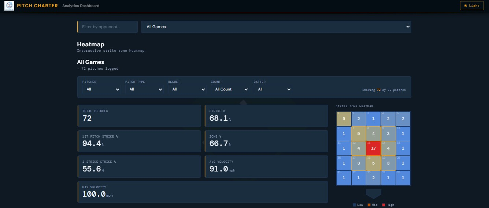

# Pitch Charter — Analytics Dashboard

A React-based analytics dashboard for visualizing baseball pitching data. Connects to an AWS-backed API to display per-game and all-season pitch metrics with interactive filtering.



---

## Features

- **Strike Zone Heatmap** — 5×5 zone grid with color-coded pitch frequency (blue → yellow → red)
- **Metric Cards** — Total pitches, Strike %, 1st Pitch Strike %, Zone %, 2-Strike Strike %, Avg/Max velocity
- **Pitch Mix** — Breakdown of pitch type usage
- **Count Grid** — Strike % by individual count (0-0 through 3-2)
- **Count Situations** — Ahead / Even / Behind analysis with strike effectiveness per situation
- **Split Stats** — Per pitch type: pitch count, strike %, zone %, avg velocity
- **Filters** — Slice data by pitcher, pitch type, result, count, and batter handedness
- **Game Selector** — Search by opponent, select individual games or aggregate all games
- **Light / Dark mode** — Persisted via localStorage, respects system preference on first load

---

## Tech Stack

- **Frontend:** React 18, Vite
- **Styling:** CSS custom properties (no CSS framework)
- **API:** AWS API Gateway (REST) → DynamoDB
- **Auth:** API Gateway API key (`x-api-key` header)

---

## Getting Started

### 1. Install dependencies

```bash
npm install
```

### 2. Configure environment variables

Copy the example file and fill in your values:

```bash
cp .env.example .env
```

Edit `.env`:

```
VITE_API_BASE_URL=https://your-api-id.execute-api.us-east-2.amazonaws.com/prod
VITE_API_KEY=your-api-gateway-key-here
```

Both values come from the AWS API Gateway console. See [API Key Setup](#api-key-setup) below.

### 3. Start the dev server

```bash
npm run dev
```

### 4. Build for production

```bash
npm run build
```

---

## Environment Variables

| Variable | Required | Description |
|---|---|---|
| `VITE_API_BASE_URL` | Yes | AWS API Gateway base URL (no trailing slash) |
| `VITE_API_KEY` | Yes | API Gateway API key for request authentication |

> These are inlined into the JS bundle at build time (Vite behavior). Keep the API key protected with a Usage Plan and rate limiting in API Gateway.

---

## API Key Setup

The app sends an `x-api-key` header on every request. To enforce it on the AWS side:

1. **API Gateway console → API Keys** → Create API key → copy the value into `.env`
2. **Usage Plans** → Create plan → attach the API key + your `prod` stage
3. **Resources** → for each route (`GET /games`, `GET /pitches`) → Method Request → set **API Key Required = true**
4. **Actions → Deploy API** to `prod`

Without completing these steps, the header is sent but not enforced.

---

## Project Structure

```
src/
  components/
    CountGrid.jsx          # Strike % by count
    CountSituations.jsx    # Ahead / Even / Behind breakdown
    MetricCards.jsx        # Summary stat cards
    PitchMix.jsx           # Pitch type usage
    SplitStatsTable.jsx    # Per pitch type stats
    StrikeZoneHeatmap.jsx  # 5x5 zone heatmap
  context/
    ThemeContext.jsx        # Dark/light mode state
  pages/
    Dashboard.jsx           # Main page, filters, data fetching
  config.js                 # API base URL + key exports
  main.jsx
  index.css                 # CSS variables, themes, global styles
public/
  Analytics_Screen.jpg
  epic-baseball-field-md.png
  pitchcharterlogo.PNG
```
